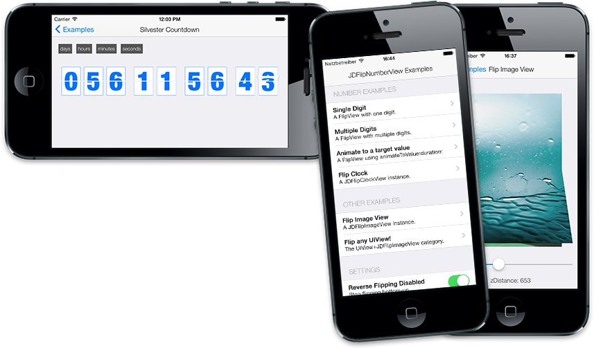
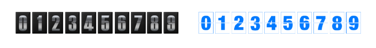

JDFlipNumberView & JDFlipImageView
----------------------------------

The FlipNumberView is simulating an analog flip display (like those for the departure time on the airport). It's well abstracted and damn easy to use. Please open a [Github issue], if you think anything is missing or wrong.

[Watch the awesome example video](http://jaydee3.github.io/JDFlipNumberView/images/Example.mov)

## Installation

#### CocoaPods

- `pod 'JDFlipNumberView'` including the default images
- `pod 'JDFlipNumberView/Core'` without default images (to use your own images)
- `pod 'JDFlipNumberView/FlipImageView'`, only the `JDFlipImageView` (for flipping images)

> See Customization below for infos, on how to use your own images.

(For infos on cocoapods, have a look the [cocoapods website])

#### Manually

1. Add all files from `JDFlipNumberView/JDFlipNumberView/*.{h,m}` to your project
2. Add the `JDFlipNumberView.bundle`, if you want to use the default images
3. Link against the `QuartzCore.framework`

## Contents

The main classes are

- `JDFlipNumberView`  
  The **Standard FlipNumberView**. It shows an integer value as FlipView.
  It has a choosable amount of digits. Can be animated in any way described in this document.

- `JDFlipImageView`  
  An **Image View** with flip animations. Use it like a regular UIImageView, but set new images animated via `setImageAnimated:duration:completion:`.
  
For specific usecases you may use on of these:
  
- `JDDateCountdownFlipView`  
  __A date countdown.__ Just init with a target date and it will show the remaining days, hours, minutes and seconds until that date.
  
- `JDFlipClockView`  
  __A digital clock.__ Displays the hour and minutes of the current time as flipViews. Seconds can also be enabled. Always shows the current time.
  
- `UIView+JDFlipImageView`  
  A **UIView category** that makes it possible to transition between any two views using a flip animation.

## Usage

In any case, after installing, you only need to follow some simple steps to get started. Here is a full example usage:

__Example:__ A 4 digit FlipNumberView animating down every second.

    // create a new FlipNumberView, set a value, start an animation
    JDFlipNumberView *flipNumberView = [[JDFlipNumberView alloc] initWithDigitCount:4];
    flipNumberView.value = 1337;
    [flipNumberView animateDownWithTimeInterval: 1.0];
    
    // add to view hierarchy and resize
    [self.view addSubview: flipNumberView];
    flipNumberView.frame = CGRectMake(20,100,300,100);

That's it. This will display a working, flipping, animating countdown view!  
See the example project for other examples.

## Possible animations

Basic animations (Single Flip):

    - (void)setValue:(NSInteger)newValue animated:(BOOL)animated;
    - (void)animateToNextNumber;
    - (void)animateToPreviousNumber;

Targeted animation over time (Flipping through all numbers, until target is reached):

    - (void)animateToValue:(NSInteger)newValue duration:(CGFloat)duration;
    
Timed animation without target value (Flipping once per `timeInterval`):

    - (void)animateUpWithTimeInterval:(NSTimeInterval)timeInterval;
    - (void)animateDownWithTimeInterval:(NSTimeInterval)timeInterval;

## Customization

*You may use the original `.psd` file from the `gfx` folder to create custom numbers.*

**A) Replace original images**  
Replace the images within the `JDFlipNumberView.bundle`. (In the Finder just `Rightclick > Show Contents` to see the images.)

> When using Pods, make sure to use `pod 'JDFlipNumberView/Core'`, so the default bundle won't be copied. Just create a bundle named `JDFlipNumberView.bundle` in your project yourself.

**B) Use multiple bundles**  
Add another graphics bundle to your project. A bundle is nothing else, than a regular folder, but named with `.bundle` as extension. You need one image per digit. `0.png, 1.png, 2.png, etc.` See the next section on how to use multiple bundles.

#### Implementing a custom bundle

To use your own bundles, create the FlipViews like this:
	             
	[JDFlipNumberView initWithDigitCount:<#count#> 
                         imageBundleName:<#imageBundleName#>];

or for a DateCountDown like this:
	             
	[JDDateCountdownFlipView initWithDayDigitCount:<#count#>
                                   imageBundleName:<#imageBundleName#>];

## Twitter

I'm [@jaydee3](http://twitter.com/jaydee3) on Twitter. Feel free to [post a tweet](https://twitter.com/intent/tweet?button_hashtag=JDFlipNumberView&text=I%20discovered%20a%20very%20nice%20and%20simple-to-use%20animated%20FlipView%20for%20iOS:%20https://github.com/jaydee3/JDFlipNumberView&via=jaydee3), if you like the FlipNumberView.  

[Github issue]: https://github.com/jaydee3/JDFlipNumberView/issues
[cocoapods website]: http://cocoapods.org